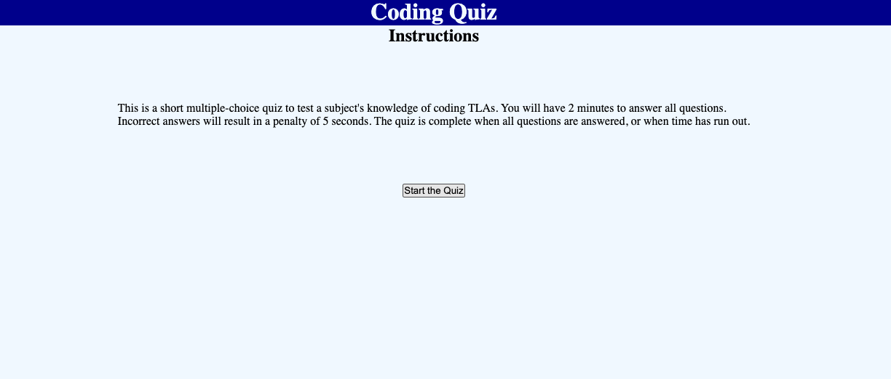

# Coding-Quiz

## Description

A brief, timed quiz to test users on the meaning of some basic coding-related acronyms, with a leaderboard feature to record winner names and scores locally. 

## Link to Deployed Website

https://spec-tr.github.io/Coding-Quiz/

## Technologies

### JavaScript
### HTML
### CSS

## Credits & Sources

Information and documentation used in the creation of this app, but external to the EdX UofT Full-Stack Software Development Bootcamp including syntaxes, best practises and instructional examples for usage came from the following sources:
- https://gomakethings.com/how-i-structure-my-javascript-projects-in-2022/
- https://www.w3schools.com/js/js_htmldom_eventlistener.asp
- 

## License

See LICENSE file in repository